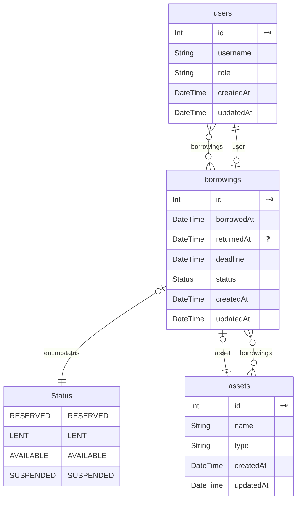

```mermaid
erDiagram

        Status {
            RESERVED RESERVED
LENT LENT
AVAILABLE AVAILABLE
SUSPENDED SUSPENDED
        }
    
  "users" {
    Int id "🗝️"
    String username 
    String role 
    DateTime createdAt 
    DateTime updatedAt 
    }
  

  "assets" {
    Int id "🗝️"
    String name 
    String type 
    DateTime createdAt 
    DateTime updatedAt 
    }
  

  "borrowings" {
    Int id "🗝️"
    DateTime borrowedAt 
    DateTime returnedAt "❓"
    DateTime deadline 
    Status status 
    DateTime createdAt 
    DateTime updatedAt 
    }
  
    "users" o{--}o "borrowings" : "borrowings"
    "assets" o{--}o "borrowings" : "borrowings"
    "borrowings" o|--|| "Status" : "enum:status"
    "borrowings" o|--|| "users" : "user"
    "borrowings" o|--|| "assets" : "asset"
```
